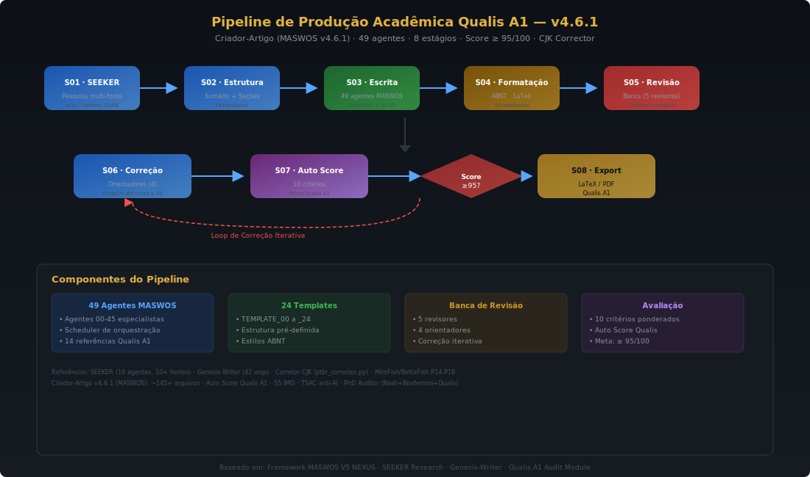
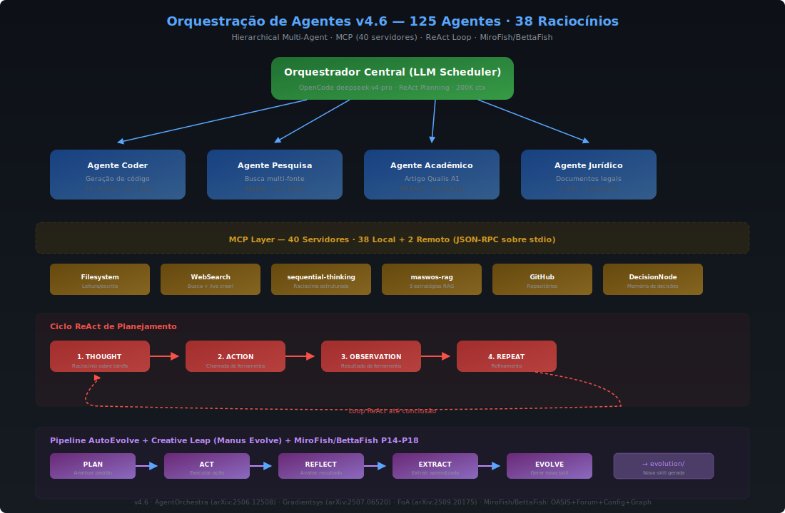

# Primeiros Passos — OpenCode Ecosystem v5.0

> **Tempo estimado:** 10–15 minutos para instalação e primeiro uso.

---

## Para quem é este guia

Este guia destina-se a:

- **Pesquisadores acadêmicos** — que desejam gerar artigos com auditoria de qualidade (10 critérios CAPES) e debate multiagente com verificadores simbólicos.
- **Desenvolvedores de IA** — interessados em arquiteturas multiagente, engenharia reversa automatizada e integração de MCPs.
- **Estudantes de computação quântica** — que buscam experimentar com VQC de 50 qubits, QML em dados médicos e mitigação de erros (ZNE/PEC).

Nenhum conhecimento prévio sobre o OpenCode Ecosystem é necessário. Este documento guiará você desde a instalação até a execução dos primeiros comandos.

---

## Pré-requisitos

Antes de iniciar, verifique se o seu ambiente atende aos seguintes requisitos:

| Componente | Versão Mínima | Observação |
|------------|:-------------:|-----------|
| **Node.js** | v22+ (LTS) | Runtime JavaScript necessário para o OpenCode CLI |
| **Bun** | 1.3+ | Gerenciador de pacotes e runtime utilizado pelo projeto |
| **Python** | 3.12+ | Necessário para os agentes, scripts Nexus e módulos quânticos |
| **OpenCode CLI** | 1.14+ | Interface de linha de comando do OpenCode |
| **Sistema Operacional** | Windows 11 (principal) | Linux e macOS também são suportados (experimental) |
| **Modelo** | `deepseek-v4-pro` | OpenCode Zen — 200K contexto, 128K saída, gratuito (⚠️ [veja aviso de privacidade](PRIVACY.md)) |

---

## Instalação Passo-a-Passo

### 1. Clonar o repositório

```bash
git clone https://github.com/MarceloClaro/OpenCode_Ecosystem.git
cd OpenCode_Ecosystem
```

### 2. Instalar dependências

O projeto utiliza o Bun como gerenciador de pacotes. As dependências incluem `@opencode-ai/plugin` e `@types/bun`:

```bash
bun install
```

### 3. Configurar o OpenCode CLI

Certifique-se de que o OpenCode CLI (versão 1.14+) esteja instalado e acessível no `PATH`. Consulte a [documentação oficial do OpenCode](https://opencode.ai) para instruções de instalação.

```bash
opencode --version
# Saída esperada: 1.14.x ou superior
```

### 4. Verificar o modelo `deepseek-v4-pro`

O modelo padrão do ecossistema é o `deepseek-v4-pro` (OpenCode Zen), que é gratuito e oferece 200K tokens de contexto com 128K tokens de saída. Verifique a disponibilidade:

```bash
opencode models
# O modelo deepseek-v4-pro deve aparecer na lista
```

---

## Comandos de Verificação

Execute os comandos abaixo para confirmar que seu ambiente está corretamente configurado:

| Comando | Saída Esperada |
|---------|---------------|
| `node --version` | `v25.x.x` |
| `bun --version` | `1.3.x` |
| `python --version` | `Python 3.12.x` |
| `opencode --version` | `1.14.x` ou superior |

---

## Primeiros Passos — 3 Exemplos

### Exemplo 1: Gerar artigo academico com auditoria CAPES

```
/artigo
```

Este comando aciona o pipeline completo de produção acadêmica:

1. **SEEKER** — pesquisa autônoma em 10+ fontes (arXiv, PubMed, OpenAlex, CORE, Semantic Scholar)
2. **MASWOS** — 49 agentes especializados em 8 estágios de escrita
3. **Banca** — 5 revisores + 4 orientadores em iteração até score ≥ 95/100
4. **AUTO_SCORE_QUALIS.py** — avaliação automática com 10 critérios ponderados
5. **Export** — LaTeX/PDF com 46 anotações TSAC auditáveis

**Resultado:** artigo de 35+ paginas em formato ABNT, com citacoes verificaveis e auditoria baseada em 10 criterios CAPES.



### Exemplo 2: Engenharia reversa de sistemas

```
/reversa
```

Aciona um pipeline de 9 agentes especializados em engenharia reversa:

```
Scout → Archaeologist → Detective → Architect → Writer → Reviewer
                                    ↓
                        Visor → Data Master → Design System
```

**Resultado:** 7 SVGs de arquitetura, mapas de dependência, ADRs e SDDs gerados automaticamente.



### Exemplo 3: Modo autônomo com todos os MCPs

```
/auto
```

Ativa o agente `openagent` com acesso a todos os 46 MCPs (servidores de contexto), permitindo execução autônoma de tarefas complexas que combinam pesquisa, código, dados e análise.

---

## Solução de Problemas Comuns

### Erro de versão do Node.js

**Sintoma:** `Error: Unsupported Node.js version`

**Solução:** Atualize o Node.js para v25 ou superior. Utilize o `nvm` para gerenciar versões:

```bash
nvm install 25
nvm use 25
```

### Modelo `deepseek-v4-pro` não disponível

**Sintoma:** `Model not found` ao executar comandos

**Solução:** Verifique a conexão com a internet e execute `opencode models` para listar os modelos disponíveis. O `deepseek-v4-pro` é gratuito e deve estar disponível automaticamente.

### MCPs não inicializando

**Sintoma:** Servidores MCP não respondem nas primeiras interações

**Explicação:** Os MCPs utilizam **lazy init** — eles só inicializam na primeira chamada de ferramenta, não durante a inicialização do sistema. Isso é comportamento esperado e reduz o tempo de startup.

**Solução:** Execute um comando que utilize o MCP desejado (por exemplo, `/artigo` para MCPs acadêmicos) e aguarde a inicialização automática.

### Erro `bun install` — dependências não instaladas

**Sintoma:** Falha ao instalar dependências

**Solução:** Verifique se o Bun está na versão 1.3+ e se o `package.json` está presente na raiz do projeto:

```bash
bun --version
ls package.json
bun install
```

---

## Próximos Passos

Agora que o ambiente está configurado, explore a documentação complementar:

| Documento | Descrição |
|-----------|-----------|
| [README.md](README.md) | Visão geral completa do ecossistema |
| [PROJECTS.md](PROJECTS.md) | Painel didático e detalhado de projetos (Kanban) |
| [TUTORIALS.md](TUTORIALS.md) | Tutoriais práticos detalhados |
| [GLOSSARY.md](GLOSSARY.md) | Glossário de termos técnicos |
| [CONTRIBUTING.md](CONTRIBUTING.md) | Guia para contribuidores |
| [ROADMAP.md](ROADMAP.md) | Visão futura do projeto |
| [AGENTS_PTBR.md](AGENTS_PTBR.md) | Documentação de agentes em PT-BR |


---

<div align="center">

**OpenCode Ecosystem v5.0** · Documentação em Português Brasileiro

</div>
