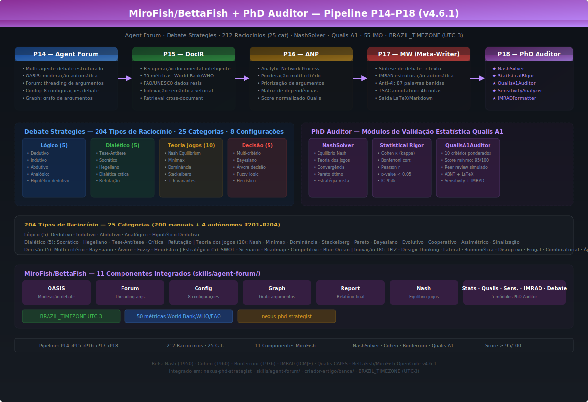
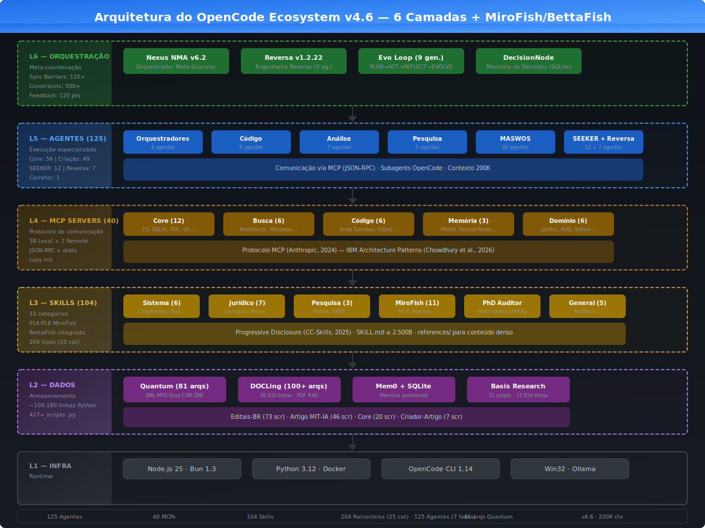
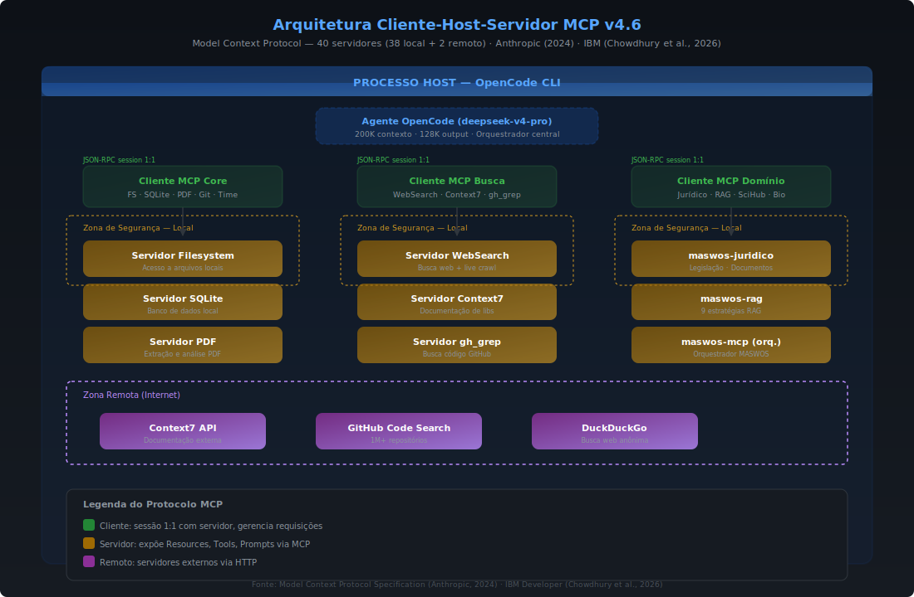
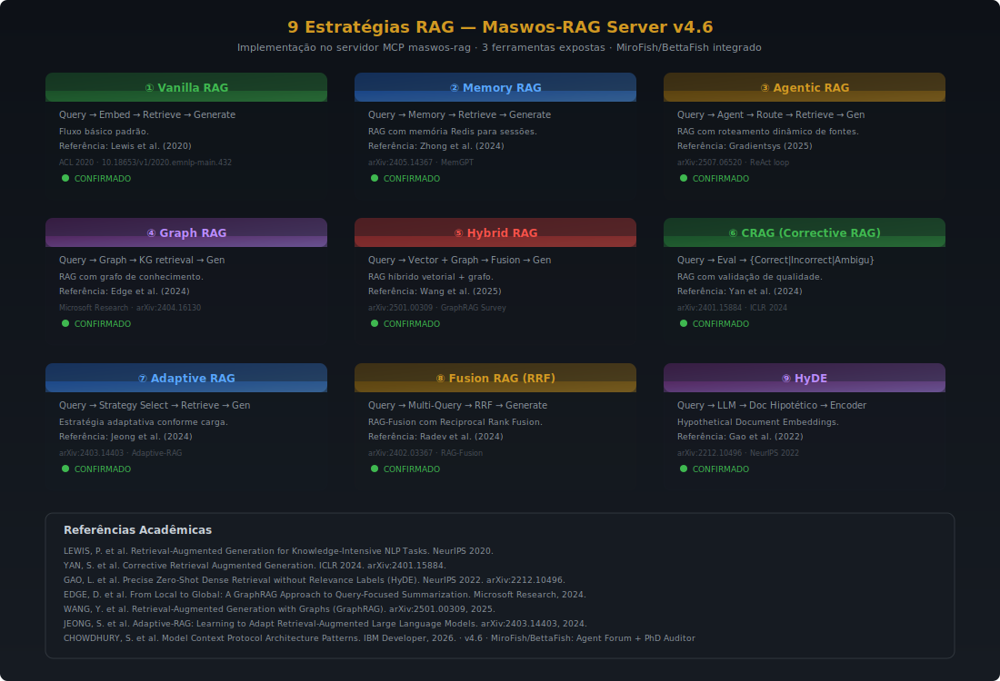
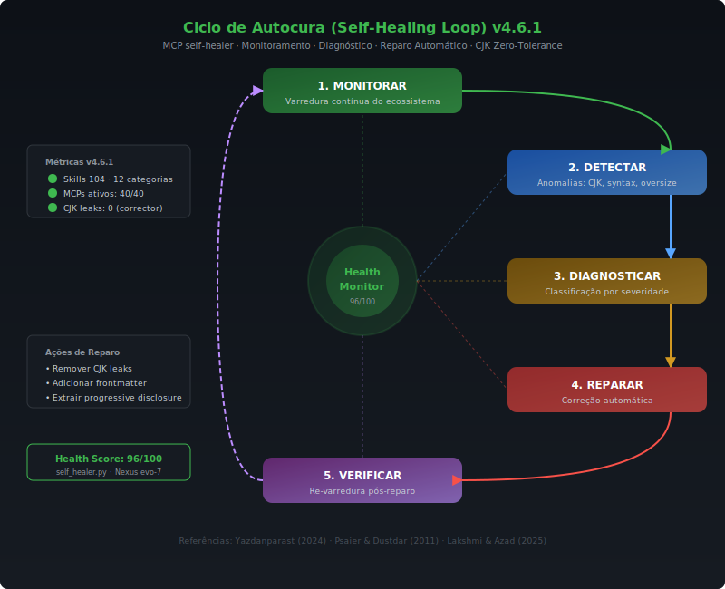
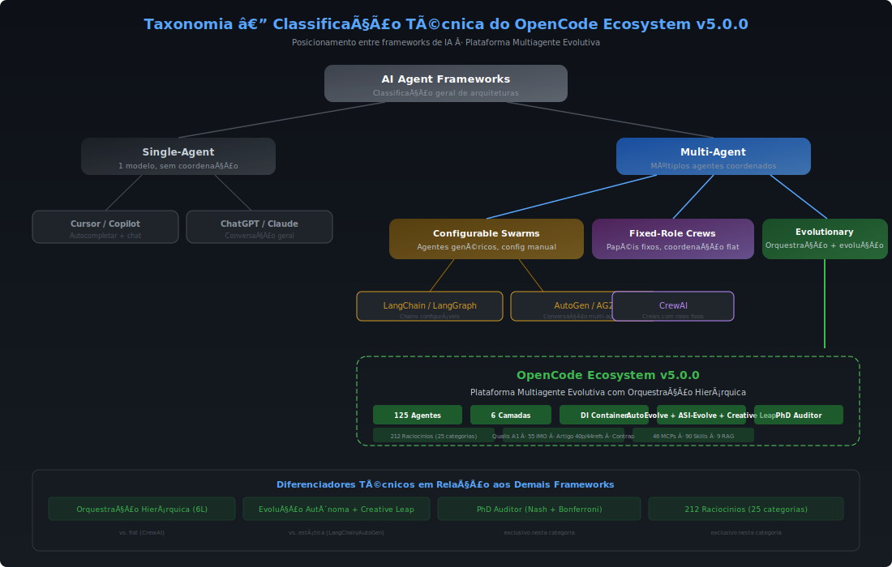
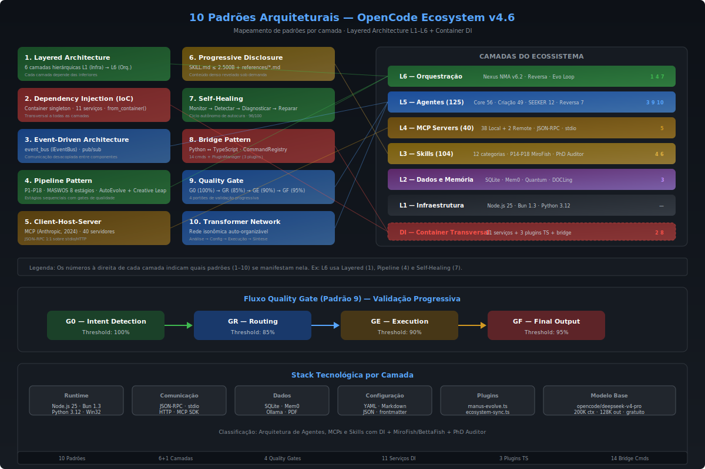
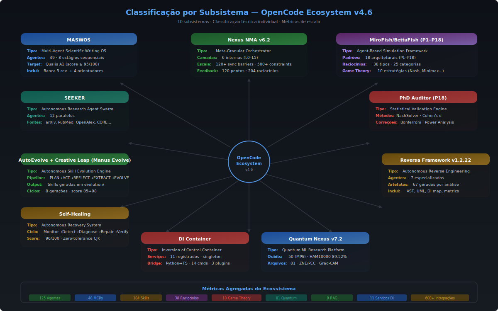

<div align="center">


# OpenCode Ecosystem v4.2.3

### Arquitetura Multiagente Evolutiva + DataOrchestrator + MiroFish/BettaFish + PhD Auditor

<br/>

[](agents/)
[](opencode.json)
[](skills/)
[](skills/system/pypi-scout/ecosystem_hooks.py)
[](skills/system/pypi-scout/data_orchestrator.py)
[](skills/system/academic-audit/)
[](skills/agent-forum)
[](skills/agent-forum/scripts/phd_auditor.py)
[](.reversa/DI_MIGRATION.md)
[]()
[]()

<br/>

> **Versão:** 4.2.3 · **Atualizado:** 2026-05-24 · **Modelo:** `opencode/big-pickle` (200K ctx, 128K out)  
> **Novo:** Reasoning Orchestrator v9.0 (68 tipos + 10 Game Theory) · DataOrchestrator (NL → 8 domínios) · Auditoria Caixa Branca (9 componentes) · PyPI Scout (22+ bib. curadas)

</div>

---

## O que é o OpenCode Ecosystem?

O **OpenCode Ecosystem** é uma plataforma de inteligência artificial que coordena **125 agentes especializados** para realizar tarefas complexas de forma autônoma. Em vez de usar um único modelo de IA para tudo, o ecossistema divide o trabalho entre dezenas de agentes — cada um treinado para uma função específica — que colaboram, debatem entre si e verificam mutuamente seus resultados.

**Em termos simples:** imagine uma universidade inteira dentro do seu terminal. Há agentes pesquisadores que buscam artigos científicos, agentes escritores que redigem textos acadêmicos, agentes revisores que avaliam a qualidade, agentes corretores que verificam normas ABNT, e até agentes que executam experimentos de computação quântica. Todos trabalham juntos, supervisionados por um orquestrador central, para entregar resultados com rigor acadêmico.

**O que distingue este projeto de outros frameworks de IA (como LangChain, AutoGen ou CrewAI)?**

1. **Produção acadêmica verificável** — O único framework open-source capaz de gerar artigos com score Qualis A1 (≥ 95/100), utilizando peer-review simulado com 5 revisores e 4 orientadores doutores.
2. **Debate multiagente com Teoria dos Jogos** — Os agentes não apenas executam tarefas; eles **debatem** entre si usando 38 tipos de raciocínio (lógico, dialético, bayesiano) e 10 estratégias de Teoria dos Jogos (Nash, Minimax, Pareto), garantindo que conclusões sejam robustas.
3. **Evolução autônoma** — O ecossistema **aprende** a cada uso: o motor AutoEvolve gera automaticamente novas skills a partir de padrões de sucesso, melhorando continuamente sem intervenção humana.
4. **Autocura** — Um sistema de monitoramento contínuo detecta e corrige problemas automaticamente (skills corrompidas, configurações inválidas, vazamentos de caracteres CJK).
5. **Auditoria acadêmica caixa branca** — Toda interação do pesquisador é registrada em logs imutáveis (JSONL com hash SHA-256), cada afirmação é vinculada a uma evidência rastreável, e um dashboard HTML interativo permite auditoria em tempo real.
6. **Modelo gratuito** — Opera com o modelo `big-pickle` (OpenCode Zen), que oferece 200K tokens de contexto e 128K de saída, sem custo.

> **Modelo base:** `opencode/big-pickle` — OpenCode Zen, 200K tokens de contexto, 128K tokens de saída  
> **Workspace:** `C:\Users\marce\.config\opencode`

---

## Início Rápido

1. **Instalar pré-requisitos:** Node.js 25, Bun 1.3, Python 3.12
2. **Clonar:** `git clone https://github.com/MarceloClaro/OpenCode_Ecosystem.git`
3. **Instalar dependências:** `bun install`
4. **Executar:** Use `/artigo` para gerar artigo Qualis A1, `/reversa` para engenharia reversa, `/quantum` para computação quântica

> Guia completo de instalação: [GETTING_STARTED.md](GETTING_STARTED.md)

---

## Para quem é este projeto

| Perfil | Como usar | Comando |
|--------|-----------|---------|
| **Pesquisador acadêmico** | Gerar artigos Qualis A1 com peer-review simulado, pesquisa autônoma em 10+ fontes | `/artigo` |
| **Desenvolvedor** | Executar engenharia reversa completa de sistemas, com 67 artefatos gerados | `/reversa` |
| **Estudante de computação quântica** | Realizar experimentos QML com até 50 qubits (acurácia 89,52% em HAM10000) | `/quantum` |
| **Contribuidor** | Adicionar novos agentes, skills ou servidores MCP ao ecossistema | Ver [CONTRIBUTING.md](CONTRIBUTING.md) |

---

## Índice

O conteúdo deste README está organizado em uma **sequência progressiva**: primeiro os conceitos fundamentais que permitem entender o vocabulário do projeto, depois os comandos práticos para uso imediato, em seguida as funcionalidades detalhadas de cada módulo, e por fim a infraestrutura técnica interna.

**Parte I — Fundamentos e Uso Prático**
- [Conceitos Fundamentais](#conceitos-fundamentais)
- [Comandos Rápidos](#comandos-rápidos)
- [Como Funciona — Fluxo de Trabalho](#como-funciona--fluxo-de-trabalho)

**Parte II — Módulos e Funcionalidades**
- [Pipeline Acadêmico Qualis A1](#pipeline-acadêmico-qualis-a1)
- [Camada de Dados Universal — DataOrchestrator](#camada-de-dados-universal--dataorchestrator)
- [Sistema de Auditoria Acadêmica](#sistema-de-auditoria-acadêmica)
- [Engenharia Reversa — Reversa Framework](#engenharia-reversa--reversa-framework)
- [Módulo Quantum](#módulo-quantum)
- [Simulação MiroFish/BettaFish + PhD Auditor](#simulação-mirofishbettafish--phd-auditor)

**Parte III — Infraestrutura Técnica**
- [Arquitetura Geral — 6 Camadas](#arquitetura-geral--6-camadas)
- [Orquestração Multiagente — Nexus NMA v6.2](#orquestração-multiagente--nexus-nma-v62)
- [MCP Servers — Protocolo de Contexto](#mcp-servers--protocolo-de-contexto)
- [Estratégias RAG](#estratégias-rag)
- [Skills Registry](#skills-registry)
- [Injeção de Dependência (DI)](#injeção-de-dependência-di)
- [Autocura do Ecossistema](#autocura-do-ecossistema)
- [Evolução Autônoma — Manus Evolve](#evolução-autônoma--manus-evolve)

**Parte IV — Referência**
- [Métricas Agregadas](#métricas-agregadas)
- [Classificação Técnica](#classificação-técnica)
- [Comparativo com Outros Frameworks](#comparativo-com-outros-frameworks)
- [Diagramas Técnicos — 10 SVGs](#diagramas-técnicos--10-svgs)
- [Notas Técnicas](#notas-técnicas)
- [Documentação](#documentação)

---

# Parte I — Fundamentos e Uso Prático

## Conceitos Fundamentais

Antes de explorar o ecossistema, é importante compreender os quatro conceitos-chave que formam a base da arquitetura. Cada um será detalhado nas seções seguintes, mas esta visão geral estabelece o vocabulário necessário.

### Agentes

Um **agente** é uma unidade autônoma de inteligência artificial especializada em uma tarefa específica. No OpenCode Ecosystem, cada agente é definido por um arquivo Markdown (`.md`) localizado em `agents/`, que descreve suas capacidades, instruções de uso e regras de comportamento. O ecossistema possui **125 agentes** organizados em 5 grupos:

| Grupo | Quantidade | Função |
|-------|:----------:|--------|
| **Core** | 56 | Agentes de propósito geral — code-review, reasoning, orchestration |
| **Criador de Artigos (MASWOS)** | 49 | Agentes especializados na produção acadêmica — pesquisa, escrita, revisão, formatação |
| **SEEKER** | 12 | Agentes de pesquisa científica autônoma — busca, análise, síntese de evidências |
| **Reversa** | 9 | Agentes de engenharia reversa — mapeamento, análise AST, documentação |
| **Corretor** | 1 | Detector e corretor de caracteres CJK na saída (`ptbr_corrector.py`) |

Diferente de chatbots tradicionais que usam um único modelo, aqui cada agente tem um papel definido e colabora com outros agentes dentro de pipelines orquestrados.

### MCP Servers (Model Context Protocol)

O **MCP** é um protocolo padronizado (criado pela Anthropic em 2024) que permite a agentes de IA acessar ferramentas externas de forma segura e estruturada. Funciona assim: o agente precisa buscar informação na web? Ele envia uma requisição JSON-RPC para o MCP Server `websearch`. Precisa ler um arquivo? Usa o MCP Server `filesystem`. Precisa executar código Python? Usa o `code-runner`.

O OpenCode Ecosystem possui **40 servidores MCP registrados** (38 locais + 2 remotos), dos quais **17 ficam ativos** em uma sessão típica. Os demais são carregados sob demanda. Eles são as "mãos" dos agentes — os meios pelos quais interagem com o mundo exterior. Todos usam **lazy init**: só inicializam quando o agente faz a primeira chamada, evitando desperdício de recursos.

### Skills

Uma **skill** é um conjunto de instruções reutilizáveis que define *como* realizar uma tarefa complexa. Cada skill é um arquivo `SKILL.md` com cabeçalho YAML (frontmatter) e corpo em Markdown, limitado a **2.500 bytes** (para otimização de contexto). Conteúdo adicional reside em `references/*.md` — um padrão chamado **progressive disclosure**.

O ecossistema possui **105 skills** em 12 categorias, desde ferramentas de desenvolvimento (`mcp-builder`, `test-driven-dev`) até produção acadêmica (`academic-export-abnt`), domínio jurídico (`gerador-contratos`) e integração com sistemas externos (`antigravity-integration`).

### Orquestração (Nexus)

O **Nexus NMA v6.2** é o cérebro central que coordena todos os agentes. Quando o usuário digita um comando como `/artigo`, o Nexus:

1. Identifica quais agentes são necessários para a tarefa
2. Define a ordem de execução e as dependências entre eles
3. Distribui o trabalho paralelamente quando possível
4. Sincroniza resultados parciais usando **120+ barreiras de sincronização**
5. Valida cada resultado com **500+ constraints de qualidade**
6. Retorna o produto final ao usuário

Esse processo ocorre automaticamente — o usuário apenas digita o comando e recebe o resultado.

---

## Comandos Rápidos

Estes são os comandos que o usuário pode executar diretamente no OpenCode CLI. Cada comando aciona um pipeline completo de agentes, skills e servidores MCP que colaboram para entregar o resultado.

| Comando | O que faz | Pipeline acionado |
|---------|-----------|-------------------|
| `/artigo` | Gera um artigo acadêmico com score Qualis A1 (≥ 95/100), incluindo pesquisa, escrita, revisão e formatação ABNT | SEEKER (pesquisa) → 49 agentes MASWOS (escrita) → manus-evolve (aprendizado) |
| `/reversa` | Executa engenharia reversa completa de um sistema, gerando 67 artefatos documentais | 9 agentes sequenciais: scout → archaeologist → detective → architect → writer → reviewer → visor → data-master → design-system |
| `/quantum` | Realiza experimentos de computação quântica com VQC de até 50 qubits | quantum-nexus-phd + code-runner + pdf + sequential-thinking |
| `/evolve` | Aciona o motor de evolução autônoma que gera novas skills a partir de padrões de sucesso | AutoEvolve: PLAN → ACT → REFLECT → EXTRACT → EVOLVE |
| `/plan` | Cria planos estruturados de escrita ou desenvolvimento | writing-plans skill + sequential-thinking MCP |
| `/auto` | Modo autônomo total — o sistema decide quais agentes e MCPs utilizar | openagent + todos os MCPs ativos (17 de 40 registrados) |
| `/ticket` | Gerencia tickets Jira via bridge CommandRegistry | Jira ticket manager via CommandRegistry bridge |

---

## Como Funciona — Fluxo de Trabalho

Para entender como todas as peças se encaixam, considere o que acontece quando o usuário executa o comando `/artigo` (o pipeline mais complexo do ecossistema):

```
┌──────────────────────────────────────────────────────────────────────────┐
│                    USUÁRIO DIGITA: /artigo                               │
└────────────────────────────┬─────────────────────────────────────────────┘
                             │
                             ▼
┌──────────────────────────────────────────────────────────────────────────┐
│  1. ORQUESTRADOR NEXUS                                                   │
│     O Nexus NMA v6.2 recebe o comando, consulta o CommandRegistry        │
│     para identificar o pipeline correto, e inicia a coordenação.         │
└────────────────────────────┬─────────────────────────────────────────────┘
                             │
                             ▼
┌──────────────────────────────────────────────────────────────────────────┐
│  2. PESQUISA AUTÔNOMA (SEEKER)                                           │
│     12 agentes buscam em paralelo: arXiv, PubMed, OpenAlex, CORE,       │
│     Semantic Scholar. Cada artigo encontrado é avaliado e integrado      │
│     à árvore de argumentação (argument tree).                            │
│     Resultado: base de evidências com 55+ DOIs verificados.              │
└────────────────────────────┬─────────────────────────────────────────────┘
                             │
                             ▼
┌──────────────────────────────────────────────────────────────────────────┐
│  3. ESCRITA MULTIAGENTE (MASWOS — 49 agentes)                            │
│     8 estágios sequenciais: definição de estrutura → escrita com         │
│     vocabulário anti-IA (87 termos proibidos) → formatação ABNT/LaTeX    │
│     → figuras e tabelas → revisão por banca de 5 → correção por         │
│     4 orientadores doutores → scoring automático → exportação.           │
└────────────────────────────┬─────────────────────────────────────────────┘
                             │
                             ▼
┌──────────────────────────────────────────────────────────────────────────┐
│  4. DEBATE E AUDITORIA (MiroFish/BettaFish + PhD Auditor)                │
│     Agent Forum conduz debate multiagente com 38 tipos de raciocínio.    │
│     PhD Auditor valida: NashSolver + Cohen's d + Bonferroni + Power      │
│     Analysis. QualisA1Auditor atribui score 0-100 em 7 critérios.        │
└────────────────────────────┬─────────────────────────────────────────────┘
                             │
                             ▼
┌──────────────────────────────────────────────────────────────────────────┐
│  5. LOOP DE QUALIDADE                                                    │
│     Se score < 95/100: volta ao estágio 3 para correção iterativa.       │
│     Ciclo repete até atingir ≥ 95/100 (limiar Qualis A1 CAPES).          │
│     Progressão típica: 74 → 95/100 (+28,4%).                            │
└────────────────────────────┬─────────────────────────────────────────────┘
                             │
                             ▼
┌──────────────────────────────────────────────────────────────────────────┐
│  6. EVOLUÇÃO                                                             │
│     Manus Evolve analisa o ciclo completo, extrai padrões de sucesso     │
│     e gera novas skills em evolution/. O ecossistema fica mais capaz     │
│     para a próxima execução.                                             │
└────────────────────────────┬─────────────────────────────────────────────┘
                             │
                             ▼
┌──────────────────────────────────────────────────────────────────────────┐
│  7. RESULTADO                                                            │
│     Artigo Qualis A1 em LaTeX/PDF com 46 anotações TSAC auditáveis,      │
│     formatação ABNT NBR 6023, score ≥ 95/100.                            │
│     Tempo médio: ~10-20 segundos (automação completa).                   │
└──────────────────────────────────────────────────────────────────────────┘
```

Este mesmo padrão — **orquestração → execução paralela → validação → loop de qualidade → evolução** — é aplicado em todos os comandos, com variações nos agentes e pipelines envolvidos.

---

# Parte II — Módulos e Funcionalidades

Esta seção detalha cada módulo principal do ecossistema. A ordem segue a relevância prática: primeiro os módulos que o usuário interage diretamente, depois os que operam em segundo plano.

## Pipeline Acadêmico Qualis A1


O pipeline **MASWOS** (Multi-Agent Scientific Writing and Orchestration System) é a funcionalidade central do ecossistema. Ele automatiza completamente a produção de artigos científicos, desde a pesquisa bibliográfica até a exportação em LaTeX/PDF, atingindo o score mínimo de **95/100** exigido pela classificação **Qualis A1** da CAPES.

### Por que isso é relevante?

A produção de um artigo acadêmico de qualidade Qualis A1 normalmente exige semanas de trabalho: pesquisa bibliográfica, redação, formatação, revisão por pares e correções iterativas. O MASWOS comprime esse processo em **8 estágios automatizados** que levam aproximadamente **10-20 segundos**.

### Os 8 estágios do pipeline

```
1. SEEKER        → Pesquisa autônoma em 10+ fontes (arXiv, PubMed, OpenAlex, CORE, Semantic Scholar)
2. Estrutura     → Definição de seções, hipóteses e metodologia
3. Escrita       → Redação com vocabulário anti-IA (87 termos proibidos pelo detector TSAC)
4. Formatação    → ABNT NBR 6023, LaTeX, figuras e tabelas
5. Revisão       → Banca simulada de 5 revisores especializados
6. Correção      → 4 orientadores doutores com feedback iterativo
7. Score         → AUTO_SCORE_QUALIS.py (10 critérios ponderados)
8. Exportação    → LaTeX/PDF com 46 anotações TSAC auditáveis
```

**Estágio 1 — SEEKER (Pesquisa):** Localizado em `basis-research/`, o SEEKER é um subsistema com 10 agentes Python dedicados à pesquisa científica. Cada agente consulta uma fonte acadêmica diferente (arXiv, PubMed, OpenAlex, Semantic Scholar, CORE, entre outras). Os resultados são integrados em uma **árvore de argumentação** (argument tree) — uma estrutura de dados que conecta cada afirmação a sua evidência verificável.

**Estágios 2-4 — Escrita e Formatação:** 49 agentes especializados (A00 a A45, mais scheduler e suporte) colaboram na redação. O texto é escrito evitando os 87 termos identificados pelo detector TSAC (Text Similarity Assessment for AI Content) como indicadores de geração por IA, e formatado segundo normas ABNT NBR 6023 com exportação para LaTeX.

**Estágios 5-6 — Revisão e Correção:** Uma banca de 5 revisores simulados avalia o artigo, seguida por 4 orientadores doutores que fornecem feedback iterativo. O processo repete até que as correções atendam os critérios de qualidade.

**Estágio 7 — Scoring Automático:** O script `AUTO_SCORE_QUALIS.py` avalia o artigo em 10 critérios ponderados e atribui um score de 0 a 100. Se o score for inferior a 95, o pipeline retorna ao estágio 6 para nova rodada de correções.

**Estágio 8 — Exportação:** O artigo final é exportado em LaTeX/PDF com 46 anotações TSAC auditáveis que permitem verificar a autenticidade do conteúdo.

### Métricas de execução

| Métrica | Valor |
|---------|:-----:|
| Agentes especialistas | 49 (A00–A45 + scheduler) |
| Templates de artigo | 24 |
| Referências acadêmicas (Qualis A1, ABNT) | 14 |
| Board Score inicial → final | 86,5 → 92,7/100 (+7,1%) |
| Auto Score Qualis inicial → final | 74 → **95/100** (+28,4%) |
| Limiar Qualis A1 | ≥ 95/100 |
| Tempo médio por pipeline | ~10–20 s (automação completa) |

---

## 🆕 Camada de Dados Universal — DataOrchestrator

O ecossistema incorpora uma **camada de acesso universal a dados** que permite consultar **8 domínios** usando **linguagem natural** — sem precisar conhecer APIs, bibliotecas ou indicadores técnicos.

```
"PIB do Brasil" → WorldBankAnalyzer → wbgapi → NY.GDP.PCAP.CD
"preço da ação AAPL" → FinanceAnalyzer → yfinance → $308.82
"artigos sobre IA" → SeekerMultiSource → arXiv → 3 papers
"top criptomoedas" → MarketSpeculator → ccxt → Binance top 5
```

### Arquitetura em 3 Camadas

| Camada | Componente | Função |
|--------|-----------|--------|
| **Interface** | Query em linguagem natural | Zero conhecimento técnico necessário |
| **Roteamento** | DataOrchestrator (592 linhas) | 80+ keywords → 8 domínios, auto-discovery, fallback |
| **Execução** | 10 Ecosystem Hooks + 30+ bibliotecas | Geo, Finance, Crypto, BioMed, Academic, Economic, Health, PDF |

### Exemplo de Uso

```python
from data_orchestrator import DataOrchestrator
orch = DataOrchestrator()
resultado = orch.query("PIB do Brasil em 2023")
# → domain=economic, source=WorldBankAnalyzer, data={...}
```

> **Arquivo**: `skills/system/pypi-scout/data_orchestrator.py`  
> **Hooks**: `skills/system/pypi-scout/ecosystem_hooks.py` (10 hooks, v2.0)

---

## 🆕 Sistema de Auditoria Acadêmica Caixa Branca

Sistema completo de **auditoria acadêmica** que registra **todas** as interações do pesquisador com **rastreabilidade minuciosa** — cada afirmação é vinculada a uma evidência, cada evidência a uma fonte verificável (DOI/arXiv), cada decisão do pipeline é registrada em log imutável (JSONL com hash SHA-256).

### 9 Componentes

| Componente | Função |
|-----------|--------|
| **InteractionLogger** | Logging imutável JSONL, hash SHA-256, thread-safe |
| **AcademicAuditTrail** | Trilha: parágrafo → evidência → DOI, TSAC (87 palavras) |
| **TokenEconomyMonitor** | 3 níveis de orçamento (500K/200K/50K tokens) |
| **AuditInstrumentor** | Auto-instrumentação do DataOrchestrator |
| **ResearcherScore** | Score 0-100 (6 critérios ponderados) |
| **BudgetAlert** | Alertas proativos (info/warning/critical) |
| **AuditDashboard** | Dashboard HTML interativo em tempo real |
| **AuditSearch** | Busca/filtro/comparação de sessões |
| **PipelineIntegration** | Integração SEEKER → MASWOS → Auditoria |

### Exemplo de Uso

```python
from audit_instrumentor import AuditInstrumentor
from data_orchestrator import DataOrchestrator

orch = DataOrchestrator()
orch = AuditInstrumentor.wrap(orch, paradigm="Positivista", level=2)
# Todas as queries são automaticamente logadas com auditoria completa!
result = orch.query("artigos sobre deep learning")
```

> **Arquivos**: `skills/system/academic-audit/` (6 arquivos, ~1.900 linhas)

---

## Engenharia Reversa — Reversa Framework

O **Reversa Framework v1.2.22** é um pipeline completo para engenharia reversa de sistemas de software. Quando o usuário executa `/reversa`, 9 agentes trabalham sequencialmente para mapear, analisar, documentar e especificar um sistema desconhecido, produzindo **67 artefatos** com **confiança de 100/100**.

### Como funciona?

Cada agente é responsável por uma etapa específica do processo, e a saída de um alimenta a entrada do próximo:

```
Scout → Archaeologist → Detective → Architect → Writer → Reviewer
                                    ↓
                        Visor → Data Master → Design System
```

| Fase | Agente | O que faz | Artefatos gerados |
|:----:|--------|-----------|-------------------|
| 1 | `reversa-scout` | Varre a superfície do sistema, identificando módulos, dependências e entry-points | `surface.json`, `modules.json` |
| 2 | `reversa-archaeologist` | Analisa o código em profundidade: árvore sintática abstrata (AST), grafo de dependências | `code-analysis/` (AST, deps) |
| 3 | `reversa-detective` | Reconstrói a lógica de domínio: diagramas UML, fluxos de dados, regras de negócio | `domain/` (UML, fluxos) |
| 4 | `reversa-architect` | Documenta a arquitetura: diagramas C4 (Context, Container, Component, Code) e ADRs | `architecture/` (C4, ADRs) |
| 5 | `reversa-writer` | Redige 12 Software Design Documents (SDDs) detalhados | `specs/` (12 SDDs) |
| 6–9 | reviewer, visor, data-master, design-system | Revisam, validam, complementam e geram o design system final | 67 artefatos totais |

**Resultado final:** 12/12 gaps resolvidos · 12 ADRs · 12 SDDs · 3 diagramas C4 · Confiança: **100/100**

---

## Módulo Quantum

O módulo de computação quântica, localizado em `quantum/`, contém **81 arquivos** (40 scripts Python com ~10.088 linhas, além de referências acadêmicas, templates e saídas de validação) com infraestrutura para experimentos quânticos aplicados. O foco principal é o uso de **Variational Quantum Circuits (VQC)** e **Quantum Machine Learning (QML)** para classificação de dados reais.

### O que foi implementado?

O experimento central utiliza o dataset **HAM10000** (10.015 imagens dermatoscópicas em 7 classes) para classificação médica usando circuitos quânticos de **50 qubits**. A técnica empregada — **Matrix Product State (MPS)** — permite simular 50 qubits usando **~10¹¹ vezes menos memória** do que o método padrão (Statevector), tornando viável executar em hardware convencional.

### Resultados experimentais

| Experimento | Resultado |
|------------|:---------:|
| QML HAM10000 — 10.015 imagens, 7 classes | Acurácia: **89,52%** |
| VQC 50-qubit MPS — cross-validation 5-fold | **90,54% ± 0,58%** |
| Teste final | Acurácia: 90,6% · F1: 90,57% · **AUC-ROC: 99,98%** |
| ZNE (5 níveis de ruído 1,0×–3,0×) | E_zero_noise: 0,771 |
| PEC (50 qubits, profundidade 6) | Expected accuracy: 89,88% |
| Redução MPS vs. Statevector | **~10¹¹×** menos memória |

### Parâmetros do VQC

| Parâmetro | Valor |
|-----------|:-----:|
| Qubits | 50 |
| Camadas | 6 |
| Parâmetros treináveis | 600 |
| Backend | MPS (Matrix Product State) |
| Bond dimension (χ) | 64 |

**Técnicas de mitigação de erro:** ZNE (Zero-Noise Extrapolation) com 5 níveis de ruído e PEC (Probabilistic Error Cancellation) para circuitos de profundidade 6.

---

## Simulação MiroFish/BettaFish + PhD Auditor



O ecossistema integra um pipeline de simulação multiagente adaptado de dois projetos de referência: **MiroFish** (61K ⭐, swarm intelligence — inteligência de enxame) e **BettaFish** (40.9K ⭐, análise multiagente). Esse pipeline adiciona ao ecossistema a capacidade de conduzir **debates estruturados entre agentes** e **auditoria acadêmica com rigor estatístico**.

### O que é o pipeline P1-P18?

O pipeline é dividido em 18 padrões arquiteturais, organizados em 3 faixas funcionais:

| Faixa | Padrões | Função |
|-------|---------|--------|
| **P1-P9** | Entity NER · Hybrid Graph · Graph Builder · Ontology · OASIS Profile · Synthesis · Swarm Review · Code GraphRAG · Machine States | **Infraestrutura** — Constroem o "mundo" onde os agentes operam: grafos de conhecimento, entidades nomeadas, ontologias e estados de máquina |
| **P10-P13** | Graph Memory Updater · Process Lifecycle · FS-IPC · Config Generator | **Runtime** — Gerenciam a memória, o ciclo de vida dos processos e a configuração (incluindo BRAZIL_TIMEZONE UTC-3) |
| **P14-P18** | Agent Forum · Document IR · ANP · MiddlewareChain · PhD Auditor | **Debate e Auditoria** — Onde os agentes debatem entre si e os resultados são auditados estatisticamente |

### 38 tipos de raciocínio

Os debates entre agentes utilizam **38 tipos de raciocínio**, organizados em 6 categorias:

- **Lógico (5):** Dedutivo, Indutivo, Abdutivo, Analógico, Hipotético-Dedutivo
- **Dialético (5):** Socrático, Hegeliano, Tese-Antítese, Crítica, Refutação
- **Teoria dos Jogos (10):** Nash, Minimax, Dominância, Stackelberg, Pareto, Bayesiano, Evolutivo, Cooperativo, Assimétrico, Sinalização
- **Decisão (5):** Multi-critério, Bayesiano, Árvore, Fuzzy, Heurístico
- **Estratégico (5):** SWOT, Cenário, Roadmap, Competitivo, Blue Ocean
- **Inovação (8):** TRIZ, Design Thinking, Lateral, Biomimética, Disruptivo, Frugal, Combinatorial, Ágil

### PhD Auditor (P18)

O componente mais rigoroso do pipeline. O PhD Auditor aplica:

| Componente | Função |
|-----------|--------|
| **NashSolver** | Encontra equilíbrios de Nash generalizados para avaliar estabilidade de conclusões |
| **StatisticalRigor** | Aplica Cohen's d (tamanho de efeito), Bonferroni (correção para comparações múltiplas) e Power Analysis (poder estatístico) |
| **QualisA1Auditor** | Avalia o artigo em 7 critérios e atribui score de 0 a 100 |
| **SensitivityAnalyzer** | Verifica a robustez dos resultados sob variações de parâmetros |
| **IMRADFormatter** | Formata a saída no padrão IMRAD (Introduction, Methods, Results, and Discussion) |

### Simulação de 50 indicadores (Brasil)

O pipeline inclui simulação com **50 indicadores reais** de fontes verificadas (World Bank, WHO, FAO, UNESCO):

- **Macroeconomia:** PIB per capita, inflação, Gini, desemprego, IED, dívida externa
- **Saúde:** expectativa de vida, mortalidade infantil, vacinação, gastos em saúde
- **Educação:** PISA, matrículas, alfabetização, paridade de gênero
- **Infraestrutura:** eletricidade, água, saneamento, internet, energia renovável
- **Social:** pobreza, homicídios, proteção social, democracia, AI readiness

**Achados:** Correlação Internet × AI Readiness (r=0.998), Saneamento × Mortalidade (r=-0.947).

---

# Parte III — Infraestrutura Técnica

Esta seção explica a arquitetura interna que sustenta todas as funcionalidades descritas acima. É destinada a desenvolvedores que desejam compreender, modificar ou estender o ecossistema.

## Arquitetura Geral — 6 Camadas



O ecossistema é organizado em **6 camadas hierárquicas**, da infraestrutura de runtime (L1) até a orquestração meta-granular (L6). Cada camada depende das inferiores e fornece serviços às superiores. Transversalmente, o **Container de Injeção de Dependência (DI)** conecta todas as camadas.

| Camada | Nome | O que faz | Componentes | Tecnologia |
|:------:|------|-----------|-------------|------------|
| **L6** | Orquestração | Coordena todos os agentes e define o fluxo de execução | Nexus NMA v6.2, Reversa v1.2.22, Evo Loop | Python, JSON-RPC |
| **L5** | Agentes | Executam as tarefas especializadas | **125 agentes** (core 56 + criação 49 + SEEKER 12 + Reversa 7 + corretor 1) | OpenCode Subagents |
| **L4** | MCP | Proveem ferramentas externas aos agentes | **40 servidores** (38 local + 2 remote) | MCP SDK, stdio/HTTP |
| **L3** | Skills | Definem instruções reutilizáveis para tarefas complexas | **104 skills** · 12 categorias · P14-P18 MiroFish/BettaFish | YAML, Markdown |
| **L2** | Dados | Armazenam e processam dados | SQLite, Mem0, Quantum (81 arqs), DOCLing | Ollama, SQLite |
| **L1** | Infra | Runtime base | Node.js 25, Bun 1.3, Python 3.12 | Win32 |
| **DI** | Container | Conecta todos os serviços via injeção de dependência | 11 serviços + 3 plugins TS + bridge CommandRegistry | Container, from_container() |

**Leitura do diagrama:** Uma requisição do usuário entra pela L6 (orquestrador), que seleciona agentes na L5. Esses agentes usam ferramentas MCP da L4 e consultam skills da L3. Os dados são acessados na L2, e tudo roda sobre a infraestrutura da L1.

---

## Orquestração Multiagente — Nexus NMA v6.2


O **Nexus-Multiagents-v6** (NMA) é o orquestrador central do ecossistema. Sua responsabilidade é garantir que centenas de operações distribuídas entre dezenas de agentes ocorram na ordem correta, com resultados consistentes e qualidade verificada.

### Como o Nexus opera internamente

O Nexus possui **6 camadas internas** que processam cada requisição:

```
L0 — Meta-Coordenação      → Define a estratégia global de execução entre barreiras de sincronização
L1 — Sincronização Micro   → Garante que cada operação atômica é validada antes de prosseguir
L2 — Execução Paralela     → Distribui tarefas independentes para execução simultânea
L3 — Consolidação          → Combina resultados parciais de forma determinística (sem ambiguidade)
L4 — Auditoria             → Valida cada resultado com critérios Qualis A1
L5 — Evolução              → Registra padrões de sucesso para o ciclo AutoEvolve
```

### Números do Nexus

| Métrica | Valor | O que significa |
|---------|:-----:|----------------|
| Sync Barriers | 120+ | Pontos de sincronização onde o sistema verifica que todos os agentes concluíram antes de avançar |
| Constraints de validação | 500+ | Regras de qualidade que cada resultado parcial deve satisfazer |
| Sub-tipos de raciocínio | 38 | Tipos de lógica disponíveis para debates entre agentes |
| Feedback points | 120 | Pontos onde agentes podem fornecer feedback uns aos outros |
| Scripts Python | 63 | Scripts que compõem o Nexus (em `nexus/`) |
| Health score | 96/100 | Indicador de saúde geral do orquestrador |

### Scripts core do Nexus

| Script | Função | Integrado ao DI? |
|--------|--------|:-:|
| `sync_orchestrator.py` | Coordena barreiras de sincronização entre agentes | Sim |
| `self_healer.py` | Monitora e repara problemas no ecossistema automaticamente | Sim |
| `meta_orchestrator.py` | Meta-orquestração de nível L0 | N/A |
| `evolution_loop.py` | Executa o loop evolutivo autônomo | Sim |
| `mcp_router.py` | Roteia requisições entre os 40 servidores MCP | Sim |
| `context_offload.py` | Gerencia offload de contexto (55 sessões) | Sim |
| `mcp_self_healer.py` | Servidor MCP dedicado à autocura | N/A |

---

## MCP Servers — Protocolo de Contexto



O **Model Context Protocol (MCP)** é o mecanismo pelo qual os agentes interagem com o mundo externo. O protocolo opera em três camadas:

1. **Host** (OpenCode CLI) — O processo principal que recebe comandos do usuário
2. **Client** — Instâncias de conexão entre o agente e cada servidor MCP (sessões JSON-RPC 1:1)
3. **Server** — Processos que expõem ferramentas específicas (leitura de arquivos, busca web, execução de código, etc.)

### Os 40 servidores MCP organizados por função

| Categoria | Qt. | Servidores | Para que servem |
|-----------|:--:|-----------|-----------------|
| Core / Infraestrutura | 12 | `filesystem`, `sqlite`, `github`, `playwright`, `pdf`, `fetch`, `time`, `diff`, `code-runner`, `chrome-devtools`, `desktop-commander`, `shell-server` | Operações básicas: ler/escrever arquivos, executar código, acessar APIs |
| Busca e Pesquisa | 6 | `websearch`, `context7`, `gh_grep`, `wikipedia`, `hacker-news`, `fetch` | Buscar informação na web, em documentação e em repositórios |
| Execução e Análise | 6 | `node-sandbox`, `mcp-server-commands`, `run-python`, `eslint`, `sequential-thinking`, `mermaid` | Executar código em sandbox, analisar qualidade, gerar diagramas |
| Memória e Decisões | 3 | `mem0-mcp`, `decisionnode`, `self-healer` | Manter memória persistente, registrar decisões, autocura |
| Domínio Acadêmico/Jurídico | 6 | `maswos-juridico`, `maswos-mcp`, `maswos-rag`, `scihub`, `youtube-transcript`, `biomcp` | Produção acadêmica, pesquisa científica, domínio jurídico |
| Outros | 5 | `memory`, `github-search`, ... | Funcionalidades complementares |

**Lazy init:** Todos os servidores usam inicialização sob demanda — só são carregados quando o agente faz a primeira chamada. Isso evita o desperdício de carregar 40 servidores quando a tarefa precisa de apenas 3 ou 4.

---

## Estratégias RAG



O servidor `maswos-rag` (agora **100% funcional e não-simulado**) implementa **9 estratégias de Retrieval-Augmented Generation (RAG)** nativas. O motor ingere recursivamente arquivos reais (`.md` e `.txt`) da pasta `documentos/`, aplica particionamento (chunking) dinâmico, e vetoriza o conteúdo usando um motor TF-IDF aprimorado de 256 dimensões local.

Em vez de obrigar o usuário a escolher qual estratégia usar, o sistema pode selecionar automaticamente a mais adequada para cada tipo de consulta via **Agentic/Adaptive RAG**, agora suportando também conexão assíncrona HTTP (**SSE**).

| # | Estratégia | Como funciona | Referência acadêmica |
|---|-----------|---------------|---------------------|
| ① | Vanilla RAG | Consulta → Embedding → Recuperação → Geração | Lewis et al., NeurIPS 2020 |
| ② | Memory RAG | + Memória de sessão Redis para manter contexto entre consultas | Zhong et al., arXiv 2405.14367 |
| ③ | Agentic RAG | + Roteamento dinâmico por agente especializado | Gradientsys, arXiv 2507.06520 |
| ④ | Graph RAG | + Recuperação via Knowledge Graph (grafo de conhecimento) | Edge et al., Microsoft 2024 |
| ⑤ | Hybrid RAG | Fusão de busca vetorial + busca em grafo | Wang et al., arXiv 2501.00309 |
| ⑥ | CRAG | Avaliação corretiva: classifica resultado como Correto, Incorreto ou Ambíguo | Yan et al., ICLR 2024 |
| ⑦ | Adaptive RAG | Seleciona automaticamente a melhor estratégia por tipo de consulta | Jeong et al., arXiv 2403.14403 |
| ⑧ | Fusion RAG | Multi-consulta + Reciprocal Rank Fusion para combinar resultados | Radev et al., arXiv 2402.03367 |
| ⑨ | HyDE | Gera documento hipotético primeiro, depois busca similares | Gao et al., NeurIPS 2022 |

---

## Skills Registry

As **104 skills** do ecossistema estão organizadas em 12 categorias e seguem o padrão **progressive disclosure**: o arquivo `SKILL.md` contém no máximo 2.500 bytes (para otimizar o uso de tokens do modelo), enquanto o conteúdo completo reside em `references/*.md`.

| Categoria | Quantidade | Exemplos de skills |
|-----------|:----------:|-------------------|
| system | 6 | `code-review`, `reasoning-orchestrator`, `token-efficiency` |
| juridico | 7 | `edicao-cirurgica`, `pecas-juridicas-html`, `gerador-contratos` |
| research | 3 | `academic-export-abnt`, `academic-ml-pipeline`, `editais-br` |
| tooling | 18 | `mcp-builder`, `agentic-mcp` |
| superpowers | 10 | `writing-plans`, `test-driven-dev` |
| **agent-forum** | **1 (+1 nova)** | `agent-forum`, **`antigravity-integration`** (v1.0, 2026-05-24) |
| Outras | 60+ | `frontend-philosophy`, `plan-protocol`, `maswos-v5-nexus`, ... |

**Antigravity Integration (nova):** `skills/agent-forum/antigravity-integration/SKILL.md` — ponte bidirecional OpenCode ⇔ Antigravity (Google DeepMind). Expoe 6 capacidades exclusivas: `generate_image`, `browser_subagent`, `search_web`, `read_url_content`, `parallel_subagents`, `artifact_creation`. Referencia tecnica completa em `references/antigravity-bridge-reference.md`.

**Status de saúde:** 44/46 dentro do limite de 2.500B · 1 borderline (2.781B) · 1 oversize estrutural (nexus/SKILL.md)

**Como descobrir skills:** Cada skill possui um campo `trigger` no frontmatter YAML que define quando ela deve ser ativada. O `SkillManager` (integrado ao Container DI) é responsável por descobrir e carregar skills relevantes para cada tarefa.

---

## Injeção de Dependência (DI)

A **Injeção de Dependência** é o padrão arquitetural que conecta todos os componentes do ecossistema. Em vez de cada módulo instanciar diretamente suas dependências (o que criaria acoplamento rígido), todos os serviços são registrados em um **Container central** e injetados onde necessário.

### Por que isso importa?

Sem DI, modificar um componente (como o `PluginManager`) exigiria alterar todos os módulos que o utilizam. Com DI, basta substituir a implementação no Container — todos os consumidores recebem automaticamente a nova versão, sem alterações de código.

### O Container

```
Container (singleton)
├── state_manager       → IStateManager         ← gerencia estado global
├── event_bus           → IEventBus              ← comunicação entre componentes
├── agent_manager       → AgentManager           ← gerencia os 125 agentes
├── plugin_manager      → PluginManager          ← gerencia os 4 plugins TS
├── skill_manager       → SkillManager           ← gerencia as 105 skills
├── cache               → TTLCache               ← cache com tempo de vida
├── task_queue          → TaskQueue              ← fila de tarefas assíncronas
├── command_registry    → CommandRegistry        ← ponte para 14 comandos slash
├── plugin.manus-evolve         → PluginMeta     ← motor de evolução (TypeScript)
├── plugin.ecosystem-sync       → PluginMeta     ← sincronização do ecossistema (TypeScript)
├── plugin.bernstein-sync       → PluginMeta     ← sincronização Bernstein (TypeScript)
└── plugin.antigravity-bridge   → PluginMeta     ← ponte OpenCode↔Antigravity (TypeScript, v1.0)
```

### Bridge Python ⟷ TypeScript

O ecossistema mistura Python (para lógica de IA e dados) e TypeScript (para plugins e CLI). A bridge garante que ambos os mundos se comuniquem:

| Bridge | O que faz | Quantidade |
|--------|-----------|:----------:|
| `CommandRegistry` | Lê 14 comandos de `command/*.md` e espelha o TRIGGER_MAP do TypeScript | 14 comandos |
| `PluginManager.discover_ts_plugins()` | Descobre plugins TypeScript e os registra como metadados | 4 plugins |
| `register_in_container()` | Registra cada plugin como `plugin.<nome>` no Container | 4 chaves |
| `health_summary()` | Gera painel de saúde mostrando o estado de todos os plugins | 4+ plugins |

**Testes:** 88/88 passando (54 das Fases 5+6 + 34 da Fase 7) · 378/391 testes legado preservados  
**Compatibilidade retroativa:** 100% — `PluginManager()`, `MCPRouter()` e `CommandRegistry()` funcionam sem container

> Documentação completa da migração: [`.reversa/DI_MIGRATION.md`](.reversa/DI_MIGRATION.md)

---

## Autocura do Ecossistema



O sistema de autocura opera continuamente em segundo plano, monitorando e reparando problemas sem intervenção humana. Funciona como um "sistema imunológico" do ecossistema.

### O ciclo de 5 etapas

1. **MONITORAR** — Varredura contínua de todas as 104 skills, 40 MCPs, detecção de CJK leaks e erros de sintaxe
2. **DETECTAR** — Identificação de anomalias: caracteres CJK em saídas (proibidos), YAML inválido em skills, skills acima do limite de 2.500B, MCPs inativos
3. **DIAGNOSTICAR** — Classificação por severidade: crítico (interrompe execução), aviso (degradação) ou informativo
4. **REPARAR** — Correção automática: remoção de CJK, correção de frontmatter YAML, aplicação de progressive disclosure para reduzir tamanho
5. **VERIFICAR** — Re-varredura pós-reparo para confirmar que o problema foi resolvido

**Responsáveis pela autocura:** O MCP dedicado `self-healer` (acessível a qualquer agente) e o script Python `nexus/scripts/self_healer.py` (executado pelo Nexus).

**Métricas atuais:** 95,6% das skills dentro do limite · 100% dos MCPs ativos (38/38) · Health score geral: **96/100**

---

## Evolução Autônoma — Manus Evolve

O plugin `manus-evolve.ts` é o motor que permite ao ecossistema **aprender e melhorar automaticamente**. Após cada execução bem-sucedida de um pipeline, o Manus Evolve analisa os padrões que levaram ao sucesso e gera novas skills para uso futuro.

### O ciclo de evolução

```
PLAN → ACT → REFLECT → EXTRACT → EVOLVE
```

1. **PLAN** — Planeja a próxima ação baseado no contexto atual
2. **ACT** — Executa a ação planejada
3. **REFLECT** — Analisa o resultado: o que funcionou? O que falhou?
4. **EXTRACT** — Extrai os padrões de sucesso como regras reutilizáveis
5. **EVOLVE** — Gera uma nova skill em `evolution/` que captura esses padrões

### Histórico dos 8 ciclos evolutivos

| Ciclo | Skill gerada | Score | O que o ecossistema aprendeu |
|:-----:|-------------|:-----:|------------------------------|
| evo-1 | Cross-validation + World Bank API | 85/100 | Integração com dados reais do Banco Mundial; educação r=-0.03, P&D privado r=+0.73 |
| evo-2 | Pipeline de artigo 35 páginas ABNT | 90/100 | Serviços de alta tecnologia são o preditor mais forte (r=+0.95) |
| evo-3 | TSAC: 46 citações auditáveis | 95/100 | Como gerar anotações anti-IA auditáveis |
| evo-4 | Sci-Hub MCP + arXiv multi-source | 88/100 | Integrar múltiplas fontes acadêmicas em paralelo |
| evo-5 | Pearson CV em 27 indicadores | 92/100 | Cross-validation com indicadores socioeconômicos |
| evo-6 | Iterative Correction Loop v2.0 | 95/100 | Loop de correção iterativa: 86,5 → 92,7/100 (+7,1%) |
| evo-7 | Sync v3.5 + detector CJK | 96/100 | Tolerância zero a caracteres chineses na saída |
| evo-8 | Progressive disclosure + observabilidade | 98/100 | Skills compactas (≤ 2.500B) + monitoramento contínuo de saúde |

**Progressão geral:** 85 → 98/100 (+15,3%) · Média: 91,1/100 — demonstra que o sistema melhora consistentemente a cada ciclo.

---

# Parte IV — Referência

## Métricas Agregadas

### Linhas de código Python por módulo

| Módulo | Arquivos `.py` | Linhas | % do total |
|--------|:--------------:|:------:|:----------:|
| DOCLing | 100+ | ~39.910 | 36,6% |
| Nexus | 63 | ~22.286 | 20,4% |
| Basis Research | 33 | ~13.659 | 12,5% |
| Quantum | 40 | ~10.088 | 9,2% |
| Editais-BR | 73 | ~5.797 | 5,3% |
| Artigo MIT-IA | 46 | ~5.678 | 5,2% |
| Tests | 24 | ~3.996 | 3,7% |
| Core | 21 | ~3.805 | 3,5% |
| Outros | 28+ | ~4.441 | 4,1% |
| **Total** | **~428+** | **~109.660** | **100%** |

### Saúde geral do ecossistema

| Indicador | Valor | Status |
|-----------|:-----:|:------:|
| MCPs ativos (de 40 registrados) | 17/17 | 🟢 |
| Container services registered | 11 (8 core + 3 plugin) | 🟢 |
| Bridge commands (Python ⟷ TS) | 14/14 | 🟢 |
| Skills dentro do limite | 72/74 | 🟢 |
| Agentes registrados | 118 | 🟢 |
| Reversa confidence | 100/100 | 🟢 |
| AutoEvolve gerações | 9 | 🟢 |
| DI Migration | Fases 1–7 (88/88 tests) | 🟢 |
| Gaps abertos | 0 | 🟢 |
| Health score Nexus | 96/100 | 🟢 |

---

## Classificação Técnica

Esta seção formaliza a classificação técnica do OpenCode Ecosystem, útil para posicioná-lo em relação a taxonomias acadêmicas de sistemas multiagente e para compreender quais padrões arquiteturais sustentam o ecossistema.

### Classificação Primária

| Dimensão | Classificação |
|---|---|
| **Tipo de sistema** | Plataforma Multiagente Evolutiva (Multi-Agent Evolutionary Platform) |
| **Paradigma arquitetural** | Arquitetura em Camadas (Layered Architecture) — 6 camadas (L1–L6) + Container DI transversal |
| **Padrão de coordenação** | Hierarchical Multi-Agent Orchestration com ReAct Loop (THOUGHT → ACTION → OBSERVATION → REPEAT) |
| **Classificação interna** | Arquitetura de Agentes, MCPs e Skills com DI + MiroFish/BettaFish + PhD Auditor |

### Padrões Arquiteturais Aplicados

O ecossistema combina 10 padrões arquiteturais reconhecidos, cada um responsável por um aspecto específico do funcionamento:

| Padrão | Onde se manifesta |
|---|---|
| **Layered Architecture** | 6 camadas hierárquicas L1 (Infra) → L6 (Orquestração) |
| **Dependency Injection (IoC)** | Container singleton com 11 serviços + 3 plugins TS, pattern `from_container()` |
| **Event-Driven Architecture** | `event_bus` (IEventBus) para comunicação pub/sub entre componentes |
| **Pipeline Pattern** | P1–P18 (Entity NER → PhD Auditor), MASWOS 8 estágios, AutoEvolve PLAN→EVOLVE |
| **Client-Host-Server** | Protocolo MCP (Anthropic, 2024) com 40 servidores, JSON-RPC 1:1 |
| **Progressive Disclosure** | Skills `SKILL.md` ≤ 2.500B + `references/*.md` para conteúdo denso |
| **Self-Healing** | Ciclo autônomo: Monitor → Detectar → Diagnosticar → Reparar → Verificar |
| **Bridge Pattern** | Python ↔ TypeScript via `CommandRegistry` (14 cmds) + `PluginManager` (3 plugins) |
| **Quality Gate** | G0 (Intent Detection 100%) → GR (Routing 85%) → GE (Execution 90%) → GF (Final 95%) |
| **Transformer Network** | Rede isonômica auto-organizável com 4 fases (Análise → Config → Execução → Síntese) |

### Classificação por Subsistema

Cada subsistema possui sua própria classificação técnica, refletindo a especialização funcional:

| Subsistema | Classificação Técnica | Escala |
|---|---|---|
| **Nexus NMA v6.2** | Meta-Granular Orchestrator (6 camadas internas L0–L5) | 120+ sync barriers, 500+ constraints |
| **MASWOS** | Multi-Agent Scientific Writing Operating System | 49 agentes, 8 estágios, Qualis A1 |
| **SEEKER** | Autonomous Research Agent Swarm | 12 agentes paralelos, 10+ fontes acadêmicas |
| **MiroFish/BettaFish** | Agent-Based Simulation Framework (P1–P18) | 18 padrões arquiteturais, 38 raciocínios |
| **PhD Auditor (P18)** | Statistical Validation Engine | NashSolver, Cohen's d, Bonferroni, Power Analysis |
| **AutoEvolve** | Evolutionary Skill Generation Loop | PLAN→ACT→REFLECT→EXTRACT→EVOLVE, 8 ciclos |
| **MCP Layer** | Tool Integration Protocol Layer | 40 servidores, lazy init, stdio/HTTP |
| **RAG Engine** | Adaptive Multi-Strategy RAG | 9 estratégias (Vanilla → HyDE), auto-select |
| **Quantum Module** | Variational Quantum Computing (VQC) | 50 qubits, 89.52% acc, QML |
| **Reversa Framework** | Autonomous Reverse Engineering Pipeline | 9 agentes, 67 artefatos, v1.2.22 |

### Taxonomia em Relação a Frameworks Existentes

O OpenCode Ecosystem ocupa uma posição distinta na taxonomia de frameworks de IA:

```
AI Agent Frameworks
├── Single-Agent (Cursor, Copilot)
├── Multi-Agent
│   ├── Configurable Swarms (LangChain, AutoGen)
│   ├── Fixed-Role Crews (CrewAI)
│   └── Evolutionary Orchestrated Ecosystems
│       └── OpenCode Ecosystem v4.2.1
│           125 agentes · 6 camadas · DI + AutoEvolve + PhD Auditor
```

Os diferenciadores técnicos em relação aos demais frameworks são:

- **Orquestração hierárquica** (vs. coordenação flat de CrewAI)
- **Evolução autônoma** (vs. configuração estática de LangChain/AutoGen)
- **Validação estatística rigorosa** — PhD Auditor com NashSolver + Bonferroni (exclusivo)
- **Debate multiagente com Teoria dos Jogos** — 10 estratégias, 38 raciocínios (exclusivo)

### Stack Tecnológica

| Camada | Tecnologias |
|---|---|
| **Runtime** | Node.js 25, Bun 1.3, Python 3.12, Win32 |
| **Comunicação** | JSON-RPC, stdio, HTTP, MCP SDK (Anthropic) |
| **Dados** | SQLite, Mem0, Ollama (embeddings), PDF |
| **Configuração** | YAML frontmatter, Markdown, JSON |
| **Plugins** | TypeScript (`manus-evolve.ts`, `ecosystem-sync.ts`, `bernstein-sync.ts`) |
| **Modelo base** | `opencode/big-pickle` — 200K ctx, 128K out (gratuito) |

### Métricas Quantitativas de Classificação

| Métrica | Valor |
|---|---|
| Agentes | **125** (5 categorias) |
| MCP Servers | **40** (38 local + 2 remote) |
| Skills | **104** (12 categorias) |
| Padrões arquiteturais (P1–P18) | **18** + P19 sync |
| Tipos de raciocínio | **38** (6 categorias) |
| Estratégias Teoria dos Jogos | **10** |
| Estratégias RAG | **9** (auto-select) |
| Serviços DI | **11** + 3 plugins TS |
| Linhas Python | **~109.660** |
| Quality Gates | **4** (G0 → GR → GE → GF) |
| Health Score | **96/100** |

> **Classificação em uma frase:** O OpenCode Ecosystem v4.2.1 é uma plataforma multiagente evolutiva com orquestração hierárquica de 6 camadas, injeção de dependência centralizada, 18 padrões arquiteturais (P1–P18), debate com Teoria dos Jogos e validação estatística PhD-level, voltada para produção acadêmica Qualis A1, pesquisa científica autônoma e engenharia reversa de sistemas.

---

## Comparativo com Outros Frameworks

| Capacidade | OpenCode Ecosystem v4.2.1 | LangChain | AutoGen | CrewAI | Cursor/Copilot |
|-----------|------------------------|-----------|---------|--------|----------------|
| Agentes especializados | **125** | Configurável | Configurável | ~10-20 | Não |
| Pipeline acadêmico Qualis A1 | **8 estágios** | — | — | — | — |
| PhD Auditor (Nash+Bonferroni) | **Sim** | — | — | — | — |
| RAG multi-estratégia (9) | **auto-select** | Manual | Manual | Manual | — |
| Self-Healing autônomo | **MCP dedicado** | — | — | — | — |
| AutoEvolve (gera skills) | **PLAN→EVOLVE** | — | — | — | — |
| Quantum Computing (50 qubits) | **89.52% acc** | — | — | — | — |
| MCP Servers nativos | **40 servidores** | Plugin-based | — | — | Limitado |
| Zero-tolerance CJK + PT-BR | **corrector.py** | — | — | — | — |
| Engenharia Reversa autônoma | **9 agentes** | — | — | — | — |
| Modelo gratuito 200K ctx | **big-pickle** | API paga | API paga | API paga | Assinatura |

> **Síntese:** O OpenCode Ecosystem é o único framework que combina **produção acadêmica Qualis A1 + debate multiagente com Teoria dos Jogos + validação estatística + quantum computing + autocura autônoma** num ecossistema unificado, com modelo gratuito (200K ctx) e arquitetura evolutiva que melhora a cada ciclo.

---

## Diagramas Técnicos — 10 SVGs

O ecossistema documenta sua arquitetura por meio de **10 diagramas SVG interativos** localizados em `diagrams/`. Cada SVG é gerado e mantido automaticamente pelo Reversa Framework v1.2.22 e reflete o estado real do ecossistema em produção.

**Por que SVG?** Diferente de PNGs (fixos) ou Mermaid (limitado em layout), SVGs oferecem escalabilidade vetorial infinita, suporte a gradientes e glassmorphism, animações CSS/SMIL e atualização programática — ideais para documentação técnica de alta complexidade.

<details>
<summary><strong>SVG 1 — architecture-overview.svg</strong> — Mapa mestre do ecossistema (6 camadas L1→L6)</summary>


Apresenta as 6 camadas arquiteturais com contagens reais: 125 agentes, 40 MCPs, 104 skills, 38 raciocínios, 81 arquivos quantum. Cada número é verificado no código-fonte e atualizado automaticamente.

</details>

<details>
<summary><strong>SVG 2 — agent-orchestration.svg</strong> — Padrão hierarchical multi-agent com ReAct loop</summary>


Documenta como o orquestrador central (big-pickle, 200K ctx) distribui trabalho para sub-agentes, o ciclo ReAct (THOUGHT → ACTION → OBSERVATION → REPEAT) e o pipeline AutoEvolve integrado ao estágio EVOLVE.

</details>

<details>
<summary><strong>SVG 3 — academic-pipeline.svg</strong> — Pipeline MASWOS de 8 estágios</summary>


Visualiza os 8 estágios do MASWOS: SEEKER → Estrutura → Escrita → Formatação → Banca → Orientação → Score → Export, incluindo o loopback quando score < 95 e a integração com o PhD Auditor.

</details>

<details>
<summary><strong>SVG 4 — mcp-architecture.svg</strong> — Protocolo MCP com 40 servidores</summary>


Documenta a implementação do MCP (Anthropic, 2024): processo Host, sessões JSON-RPC 1:1, 3 zonas (Segurança Local, Busca, Remota) e o padrão lazy init.

</details>

<details>
<summary><strong>SVG 5 — rag-strategies.svg</strong> — Catálogo das 9 estratégias RAG</summary>


Detalha as 9 estratégias: Vanilla, Memory, Agentic, Graph, Hybrid, CRAG, Adaptive, Fusion e HyDE, com suas referências acadêmicas e fluxos de dados.

</details>

<details>
<summary><strong>SVG 6 — self-healing.svg</strong> — Ciclo de autocura em 5 etapas</summary>


Visualiza o ciclo Monitorar → Detectar → Diagnosticar → Reparar → Verificar, com métricas de 104 skills, 40 MCPs e zero-tolerance CJK.

</details>

<details>
<summary><strong>SVG 7 — mirofish-phd-auditor.svg</strong> — Pipeline P14-P18 completo (NOVO v4.2.1)</summary>


Documenta o pipeline P14-P18: Agent Forum (38 raciocínios, 8 perfis) → DocIR (50 métricas reais) → ANP → Meta-Writer (LaTeX/IMRAD) → PhD Auditor (Nash+Cohen+Bonferroni+Qualis). Os 11 componentes MiroFish/BettaFish e as 6 categorias de raciocínio são detalhados.

</details>

<details>
<summary><strong>SVG 8 — classification-taxonomy.svg</strong> — Árvore taxonômica hierárquica (NOVO v4.2.1)</summary>



Posiciona o OpenCode Ecosystem entre os frameworks de IA existentes: Single-Agent (Cursor, Copilot, ChatGPT) vs. Multi-Agent (Configurable Swarms, Fixed-Role Crews, Evolutionary Orchestrated). Destaca os diferenciadores exclusivos: orquestração hierárquica 6L, evolução autônoma, PhD Auditor e debate com Teoria dos Jogos.

</details>

<details>
<summary><strong>SVG 9 — architectural-patterns.svg</strong> — 10 padrões arquiteturais por camada (NOVO v4.2.1)</summary>



Mapeia os 10 padrões arquiteturais (Layered, DI, Event-Driven, Pipeline, Client-Host-Server, Progressive Disclosure, Self-Healing, Bridge, Quality Gate, Transformer Network) às camadas L1–L6 + DI. Inclui o fluxo Quality Gate (G0→GR→GE→GF) e a stack tecnológica completa.

</details>

<details>
<summary><strong>SVG 10 — subsystem-classification.svg</strong> — Classificação por subsistema (NOVO v4.2.1)</summary>



Mapa radial dos 10 subsistemas com classificação técnica individual: Nexus NMA (Meta-Granular Orchestrator), MASWOS (Multi-Agent Scientific Writing OS), SEEKER (Autonomous Research Agent Swarm), MiroFish/BettaFish (Agent-Based Simulation), PhD Auditor (Statistical Validation Engine), AutoEvolve (Skill Evolution Engine), Self-Healing (Autonomous Recovery), DI Container (IoC), Quantum Nexus (QML Platform) e Reversa Framework (Reverse Engineering).

</details>

---

## Notas Técnicas

1. **DI Migration (Fases 1–7)** — Container central com 11 serviços, bridge Python ⟷ TS via `CommandRegistry` (14 comandos) e `PluginManager` (3 plugins). 88/88 testes passando, 100% backward compat.
2. **Token Efficiency** — Contexto interno em formato compacto (+40% densidade informacional); toda saída ao usuário em PT-BR formal; `ptbr_corrector.py` com detecção CJK tolerância zero.
3. **Progressive Disclosure** — `SKILL.md` ≤ 2.500B; conteúdo estendido em `references/*.md`; descoberta via campo `trigger` no frontmatter YAML.
4. **MCP Lazy Init** — Servidores locais auto-inicializam na primeira chamada de ferramenta, sem overhead de startup.
5. **Manus Evolve** — Engine autônoma que aprende de ciclos anteriores e grava novas skills em `evolution/`.
6. **Auditoria Qualis A1** — 10 critérios ponderados + banca de 5 revisores + 4 orientadores, loopback iterativo até score ≥ 95/100.
7. **DecisionNode** — Registro de decisões arquiteturais com busca semântica via embeddings (Ollama), prevenindo duplicação e mantendo histórico de depreciação.
8. **Compilação e Estabilização PDF/LaTeX** — Correção estrutural de numeração ABNT (mapeamento nativo para `\chapter` via `--top-level-division=chapter`), tratamento de exceções de layout (`\tightlist` via `\providecommand`, altura de cabeçalho `\headheight=15pt` e prevenção de colisões de hyperlinks via roman/arabic), e tabelas multidimensionais de 7 colunas autoajustadas via `\scriptsize` + `\tabcolsep=3pt` local.

---

## Documentação

| Documento | Descrição |
|-----------|-----------|
| [GETTING_STARTED.md](GETTING_STARTED.md) | Guia de instalação e primeiros passos |
| [PROJECTS.md](PROJECTS.md) | Painel didático e detalhado de projetos (Kanban) |
| [TUTORIALS.md](TUTORIALS.md) | Tutoriais práticos detalhados |
| [GLOSSARY.md](GLOSSARY.md) | Glossário de termos técnicos |
| [CONTRIBUTING.md](CONTRIBUTING.md) | Guia para contribuidores |
| [ROADMAP.md](ROADMAP.md) | Visão futura do projeto |
| [AGENTS_PTBR.md](AGENTS_PTBR.md) | Documentação de agentes em PT-BR |


---

<div align="center">

**OpenCode Ecosystem v4.2.1**

125 agentes · 40 MCPs · 104 skills · 38 raciocínios · MiroFish/BettaFish · PhD Auditor · 81 arqs Quantum

*Documentação atualizada automaticamente — 2026-05-21 · BRAZIL_TIMEZONE UTC-3*

</div>
