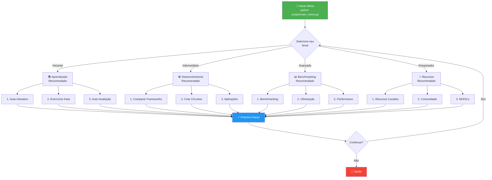
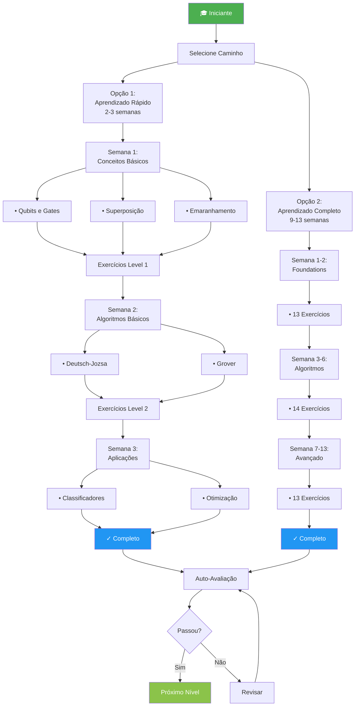
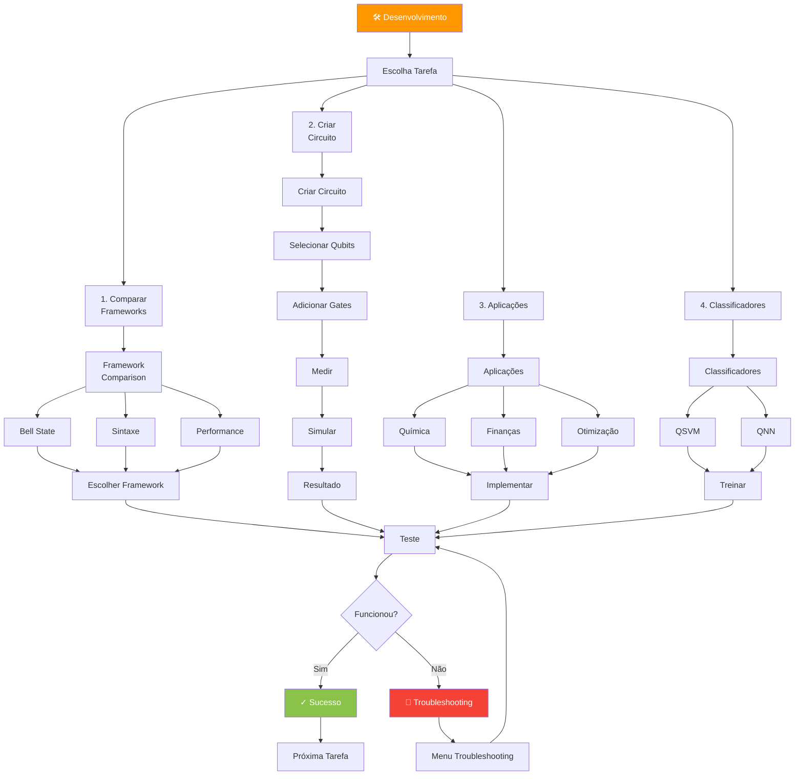
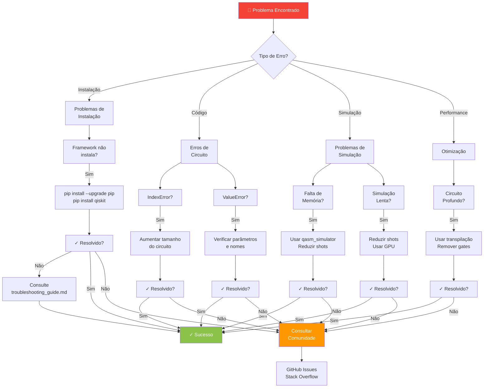
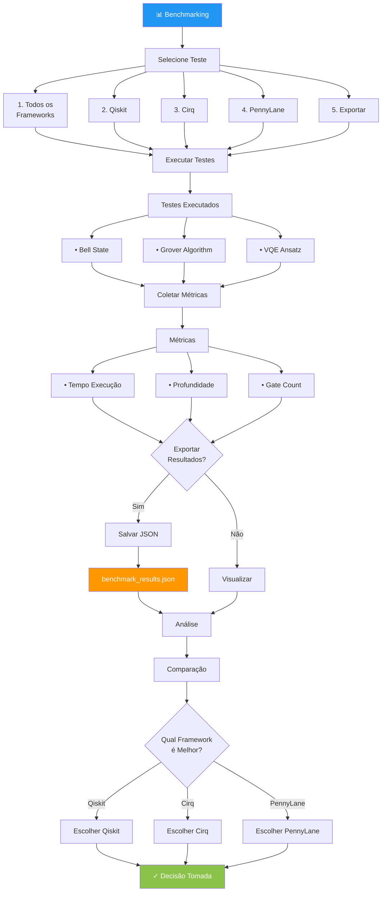
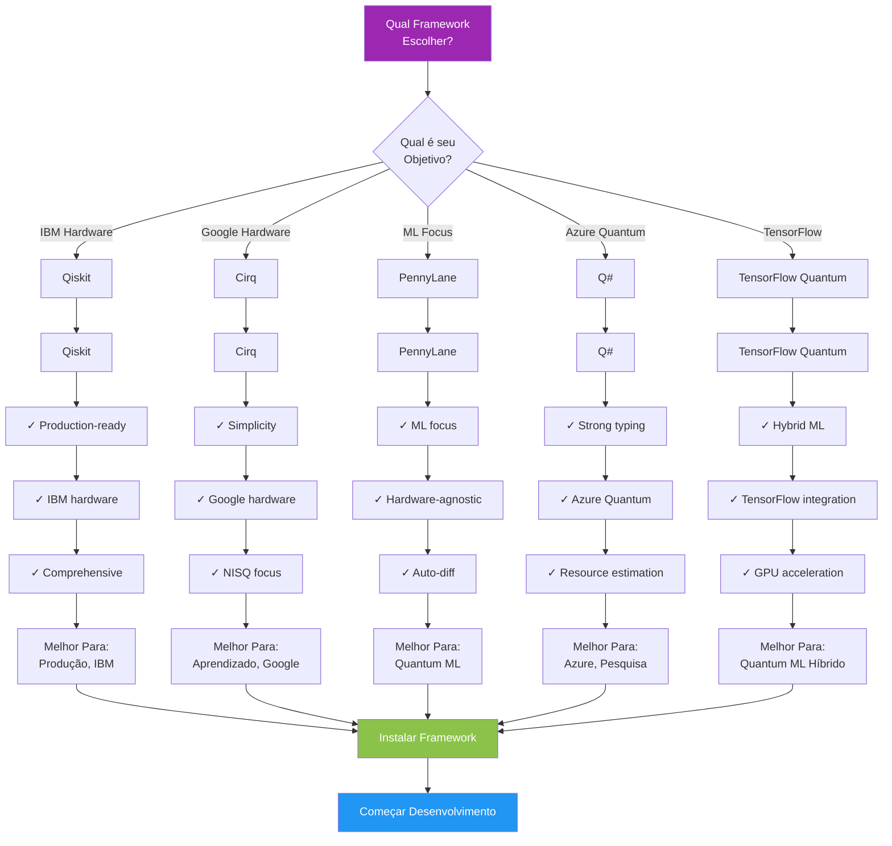
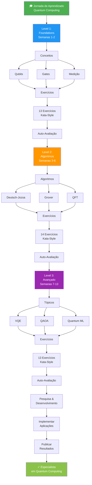
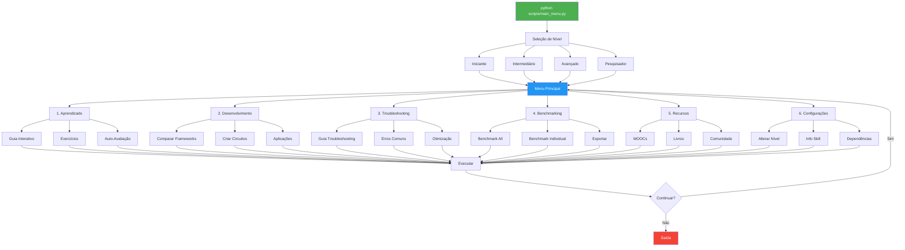
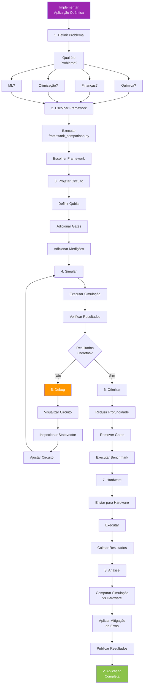
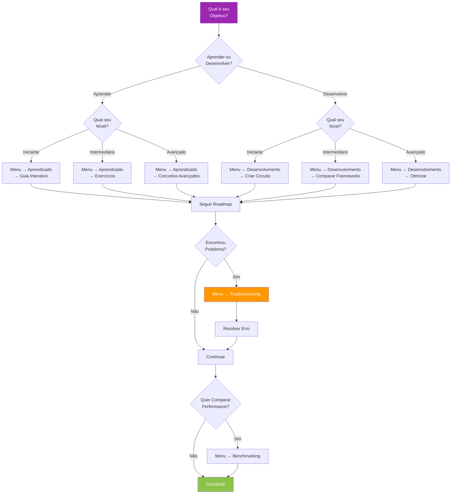

# Fluxogramas - Skill de Computação Quântica

Fluxogramas visuais para navegação e uso do skill Qiskit Quantum Computing.

---

## 1. Fluxograma Principal - Menu Interativo

---

## 2. Fluxograma de Aprendizado - Iniciante

---

## 3. Fluxograma de Desenvolvimento - Intermediário

---

## 4. Fluxograma de Troubleshooting

---

## 5. Fluxograma de Benchmarking

---

## 6. Fluxograma de Seleção de Framework

---

## 7. Fluxograma de Aprendizado Completo

---

## 8. Fluxograma de Uso do Menu

---

## 9. Fluxograma de Implementação de Aplicação

---

## 10. Fluxograma de Decisão - Qual Caminho Seguir?

---

## Legenda de Símbolos

| Símbolo | Significado |
|---------|------------|
| 🚀 | Início |
| 📚 | Aprendizado |
| 🛠️ | Desenvolvimento |
| 🔧 | Troubleshooting |
| 📊 | Benchmarking |
| 📖 | Recursos |
| ⚙️ | Configurações |
| ✓ | Sucesso |
| 👋 | Saída |
| 🎓 | Educação |
| ❌ | Erro |

---

## Como Usar os Fluxogramas

1. **Identifique seu objetivo** no fluxograma principal
2. **Siga as setas** para navegar pelo processo
3. **Tome decisões** nos pontos de decisão (losango)
4. **Execute ações** nos retângulos
5. **Verifique resultados** e ajuste conforme necessário

---

## Fluxogramas Interativos

Para versões interativas destes fluxogramas, acesse:
- Mermaid Live Editor: https://mermaid.live
- Copie e cole o código acima para editar

---

## Próximos Passos

1. **Escolha seu fluxograma**: Baseado em seu objetivo
2. **Siga o caminho**: Passo a passo
3. **Consulte o manual**: Para detalhes específicos
4. **Use o menu**: Para executar as ações

Boa sorte em sua jornada de computação quântica! 🚀
